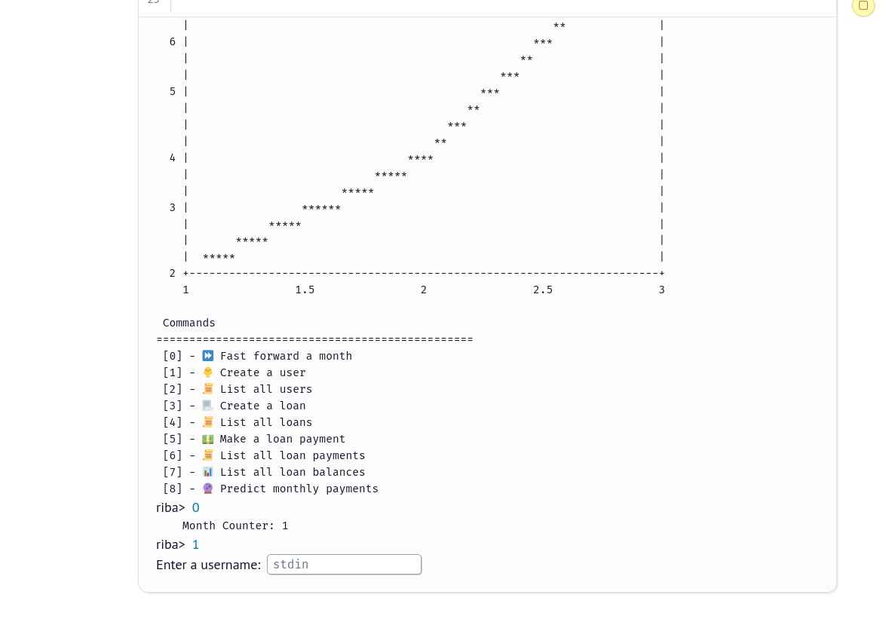

# modelling-and-simulation-assignments

The code for these assignments are written using [Marimo](https://marimo.io/) notebooks.

## Running the code on your system

1. Install [Rye](https://rye-up.com/)
2. Clone the repo
   ```sh
   $ git clone https://github.com/ch1n3du/modelling_and_simulation_assignments
   ```
3. Open the repository in your terminal and run:
   ```sh
   $ rye sync
   ```

## riba (`01_loan_manager.py`)



### Running `riba`

```sh
$ rye run marimo edit src/01_loan_manager.py
```

## Queuing Models (`02_queuing_models.py`)


### Running `Queuing Models`

```sh
$ rye run marimo run src/02_queuing_models.py
```
